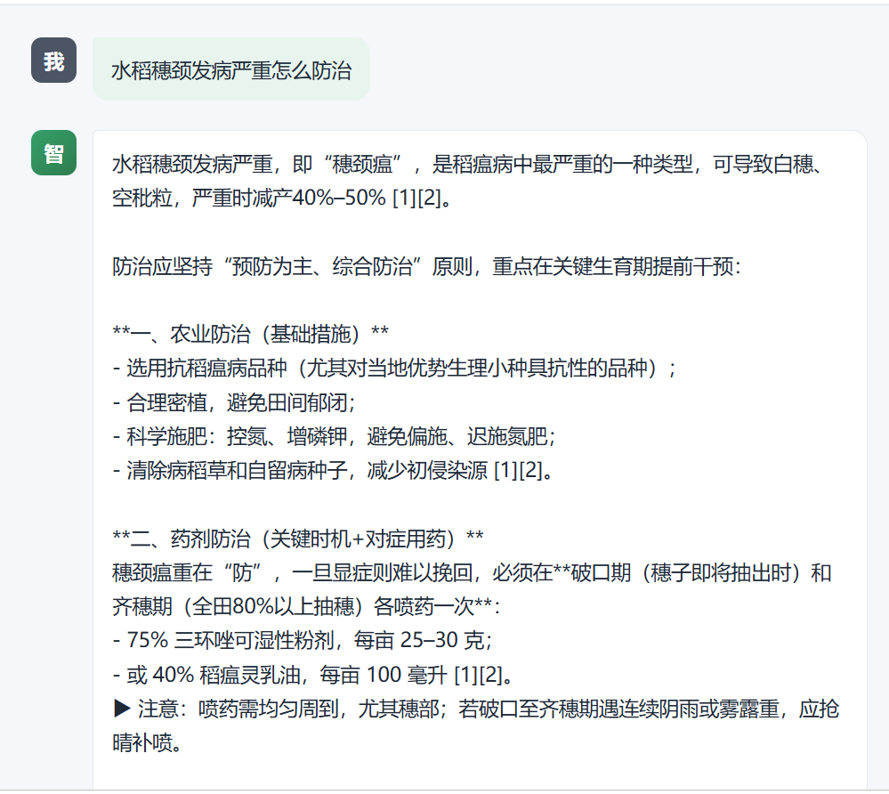
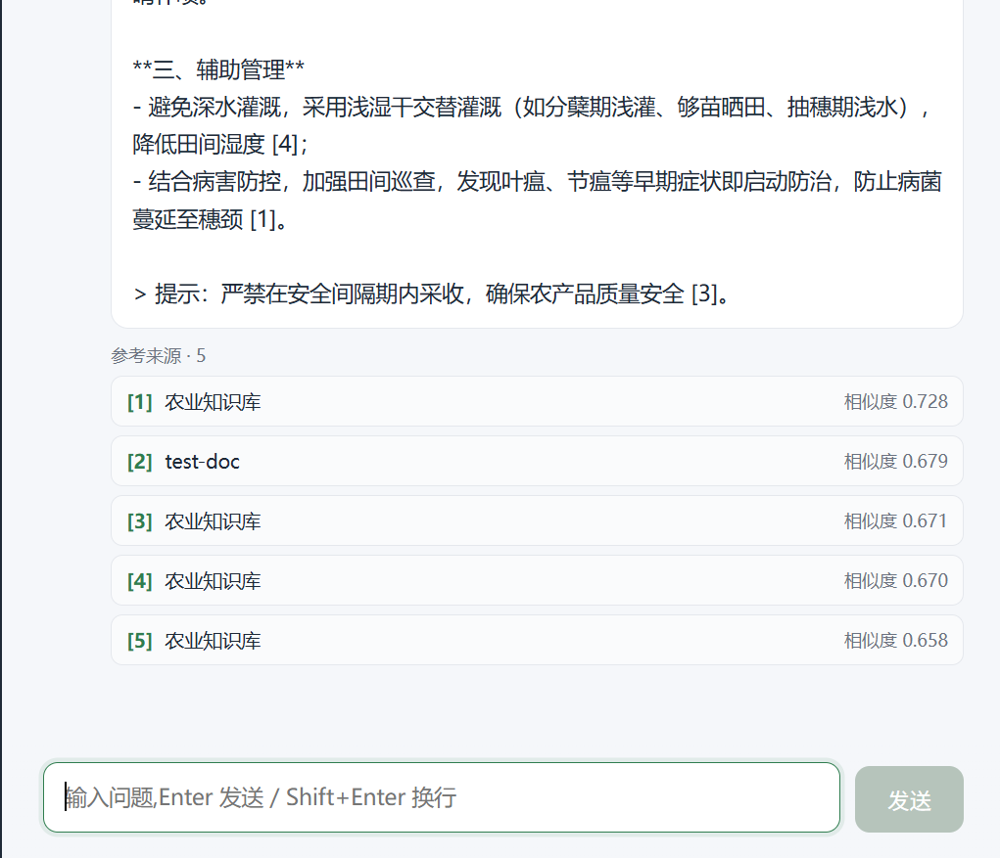
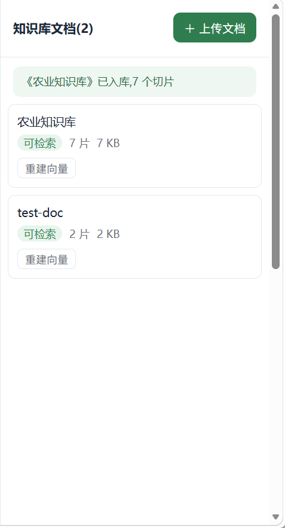

# 智问(zhiwen)— 基于 RAG 的农业领域知识库问答系统

个人项目 | Spring Boot 3 + Spring AI + PgVector + Redis | 2026.09

## 业务背景

农业领域技术文档分散在 PDF、Word、Markdown 等格式中,从业者查询病虫害防治、栽培技术等信息时依赖人工翻阅,效率低且难以精准定位。通用大模型缺乏垂直领域知识,容易产生幻觉。本项目基于 RAG 架构,将农业资料向量化入库,用户用自然语言提问即可获得**严格基于知识库、带来源引用**的准确回答。

## 个人职责

**独立完成全栈开发**(后端 + 前端 + 压测),包括:

- RAG 全链路设计:文档解析 → 语义切片 → 向量化 → 检索 → 生成
- 防幻觉机制:System Prompt 约束 + 检索 0 命中拒答 + 引用编号溯源
- 检索缓存与 IP 限流(Redis)
- SSE 流式回答 + 多轮对话(滑动窗口)
- JMeter 三场景压测 + 性能瓶颈定位与优化

## 截图展示

### 问答界面（回答 + 引用溯源）





### 文档管理面板



### 多轮会话列表


## 架构

```
┌──────────────────────────── 前端 (React 19 + Vite) ───────────────────────────┐
│  会话列表 · SSE 打字机回答 · 引用来源卡片 · 文档上传/状态面板                      │
└────────────────────────────────┬──────────────────────────────────────────────┘
                                 │ REST /api/v1 (SSE: text/event-stream)
┌────────────────────────────────▼──────────────────────────────────────────────┐
│                            后端 (Spring Boot 3)                                 │
│  DocumentController  SearchController  ChatController  ConversationController   │
│  ── 接入层 ─────────────┐                                                       │
│  CORS │ IP限流(Redis固定窗口) │ 全局异常(业务400/依赖503)                        │
│  ── 服务层 ─────────────┼───────────────────────────────────────────────────  │
│  ParserFactory(PDF按页/Word/MD去噪) → ChunkService(段落聚合+重叠窗口)            │
│  RagSearchService(语义检索) → SearchCacheService(Redis缓存)                     │
│  RagChatService(防幻觉Prompt+引用编号+降级) → ConversationService(滑动窗口)      │
│  ── 数据层 ────────────────────────────────────────────────────────────────   │
│  PostgreSQL+PgVector(HNSW 向量索引) │ Redis(检索缓存+限流计数)                   │
└────────────────────────────────┬──────────────────────────────────────────────┘
                                 │ OpenAI 兼容协议
                    ┌────────────▼────────────┐
                    │  阿里百炼 DashScope       │
                    │  text-embedding-v3(1024)│
                    │  qwen-plus(Chat)        │
                    └─────────────────────────┘
```

## 技术栈

| 层 | 选型 | 说明 |
|----|------|------|
| 框架 | Spring Boot 3.4 + Spring AI 1.0 | ChatClient 声明式编排,供应商可替换 |
| 向量库 | PostgreSQL 16 + PgVector | HNSW 索引,余弦相似度检索 |
| 缓存 | Redis 7 | 检索结果缓存 + IP 限流计数 |
| 文档解析 | Apache PDFBox / POI | PDF 按页提取(保留页码溯源) |
| 模型 | 百炼 text-embedding-v3 + qwen-plus | OpenAI 兼容协议,可平替任意供应商 |
| 压测 | JMeter 5.6.3 | 三场景实测,数据见下文 |

## 核心设计

**1. 语义切片策略** — 段落优先聚合(目标 500 字符 + 80 重叠窗口),超长段落硬切兜底;不切断完整语义单元,页码随切片入库用于溯源。

**2. 防幻觉三重机制** — System Prompt 强约束(只能依据参考资料)→ 检索 0 命中直接拒答(0 次 LLM 调用,省 token)→ 回答强制 `[n]` 编号引用,可展开原文核对。

**3. 检索缓存** — 问题归一化(去标点/大小写)MD5 作 key,命中 30min / 空结果 5min(防穿透),文档更新主动失效;压测实测吞吐量提升约 79 倍。

**4. 容错降级** — 检索故障与"无命中"严格区分(503 vs 200 拒答);LLM 故障时保住检索成果返回资料引用;流式用 Reactor timeout 做 token 间空闲检测,异常推 error 帧正常收尾。

**5. 多轮对话** — 滑动窗口(最近 10 条)控制 token 成本;追问问题拼接上轮问题做语义锚定(零 LLM 成本的指代消解);历史消息与引用来源 JSON 全部落库。

## 压测数据(JMeter,单机回环,0 错误)

| 场景 | 并发 | QPS | 平均 | P95 | P99 |
|------|------|-----|------|-----|-----|
| 冷检索(Embedding+PgVector) | 4 | 23.9 | 161ms | 211ms | 243ms |
| 热检索(Redis 缓存) | 50 | **1887** | 16ms | 31ms | 42ms |
| 端到端问答(检索+LLM) | 5 | 2.1 | 2.93s | 3.60s | 3.64s |

冷检索瓶颈为 Embedding 服务商免费配额(QPS 限流),非系统代码瓶颈。

## 快速启动

```bash
# 1. 依赖环境(Docker)
docker compose up -d        # PG16+PgVector + Redis7

# 2. 后端
export DASHSCOPE_API_KEY=sk-xxx
mvn spring-boot:run         # http://localhost:8091

# 3. 前端
cd frontend
npm install && npm run dev  # http://localhost:5174
```

## 踩坑记录(详见代码注释)

- SSE 触发 Spring MVC ASYNC 二次分派,拦截器(限流)会被执行两次,需判断 `DispatcherType.REQUEST`
- CORS 预检只拦截"非简单请求":GET/SSE 正常不代表 POST 能通
- 压测 78% 错误不一定是服务端瓶颈:压测客户端短连接会把本机端口打成 TIME_WAIT
- PgVector 相似度阈值要用真实分数分布标定(本库 0.45),不能照搬通用值
